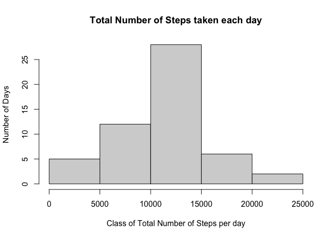

```r
knitr::opts_chunk$set(echo = TRUE)
```
## Loading and Processing data
1. Load the data (i.e. read.csv()

```r
if(!file.exists("getdata-projectfiles-UCI HAR Dataset.zip")) {
        temp <- tempfile()
        download.file("http://d396qusza40orc.cloudfront.net/repdata%2Fdata%2Factivity.zip",temp)
        unzip(temp)
        unlink(temp)
}

activity<-read.csv("activity.csv")
head(activity)
```

```
##   steps       date interval
## 1    NA 2012-10-01        0
## 2    NA 2012-10-01        5
## 3    NA 2012-10-01       10
## 4    NA 2012-10-01       15
## 5    NA 2012-10-01       20
## 6    NA 2012-10-01       25
```
2.Process/transform the data (if necessary) into a format suitable for your analysis
What is mean number of steps taken per day?
For this part of the assignment, you can ignore the missing values in the dataset. 1. Calculate the total number of steps taken per day.


```r
totalStepsByDay<-aggregate(steps~date, activity, sum)
totalStepsByDay
```

```
##          date steps
## 1  2012-10-02   126
## 2  2012-10-03 11352
## 3  2012-10-04 12116
## 4  2012-10-05 13294
## 5  2012-10-06 15420
## 6  2012-10-07 11015
## 7  2012-10-09 12811
## 8  2012-10-10  9900
## 9  2012-10-11 10304
## 10 2012-10-12 17382
## 11 2012-10-13 12426
## 12 2012-10-14 15098
## 13 2012-10-15 10139
## 14 2012-10-16 15084
## 15 2012-10-17 13452
## 16 2012-10-18 10056
## 17 2012-10-19 11829
## 18 2012-10-20 10395
## 19 2012-10-21  8821
## 20 2012-10-22 13460
## 21 2012-10-23  8918
## 22 2012-10-24  8355
## 23 2012-10-25  2492
## 24 2012-10-26  6778
## 25 2012-10-27 10119
## 26 2012-10-28 11458
## 27 2012-10-29  5018
## 28 2012-10-30  9819
## 29 2012-10-31 15414
## 30 2012-11-02 10600
## 31 2012-11-03 10571
## 32 2012-11-05 10439
## 33 2012-11-06  8334
## 34 2012-11-07 12883
## 35 2012-11-08  3219
## 36 2012-11-11 12608
## 37 2012-11-12 10765
## 38 2012-11-13  7336
## 39 2012-11-15    41
## 40 2012-11-16  5441
## 41 2012-11-17 14339
## 42 2012-11-18 15110
## 43 2012-11-19  8841
## 44 2012-11-20  4472
## 45 2012-11-21 12787
## 46 2012-11-22 20427
## 47 2012-11-23 21194
## 48 2012-11-24 14478
## 49 2012-11-25 11834
## 50 2012-11-26 11162
## 51 2012-11-27 13646
## 52 2012-11-28 10183
## 53 2012-11-29  7047
```

2.If you do not understand the difference between a histogram and a barplot, research the difference between them. Make a histogram of the total number of steps taken each day.


```r
hist(totalStepsByDay$steps, xlab="Class of Total Number of Steps per day", ylab="Number of Days", main="Total Number of Steps taken each day")
```

<!-- -->

3.Calculate and report the mean and median of the total number of steps taken per day


```r
meansteps<-mean(totalStepsByDay$steps)
mediansteps<-median(totalStepsByDay$steps)
meansteps
```

```
## [1] 10766.19
```

```r
mediansteps
```

```
## [1] 10765
```
## What is the average daily activity pattern?
1.Make a time series plot (i.e. 𝚝𝚢𝚙𝚎 = “𝚕”) of the 5-minute interval (x-axis) and the average number of steps taken, averaged across all days (y-axis)

The average number of steps taken:

```r
averageStepsbyInterval<-aggregate(steps~interval, activity, mean)
head(averageStepsbyInterval)
```

```
##   interval     steps
## 1        0 1.7169811
## 2        5 0.3396226
## 3       10 0.1320755
## 4       15 0.1509434
## 5       20 0.0754717
## 6       25 2.0943396
```
Time series plot of the average number of steps taken:

```r
with(averageStepsbyInterval, plot(interval, steps, type = "l"))
```

<!-- -->

2.Which 5-minute interval, on average across all the days in the dataset, contains the maximum number of steps?

```r
averageStepsbyInterval[which.max(averageStepsbyInterval[,2]),1]
```

```
## [1] 835
```
## Imputing missing values
Note that there are a number of days/intervals where there are missing values (coded as 𝙽𝙰). The presence of missing days may introduce bias into some calculations or summaries of the data.

1. Calculate and report the total number of missing values in the dataset (i.e. the total number of rows with 𝙽𝙰s)

```r
missingVal<-is.na(activity[,1])
sum(missingVal)
```

```
## [1] 2304
```
2.Devise a strategy for filling in all of the missing values in the dataset. The strategy does not need to be sophisticated. For example, you could use the mean/median for that day, or the mean for that 5-minute interval, etc.
Finding the mean number of steps per Interval:

```r
meanstep<-mean(averageStepsbyInterval$steps)
meanstep
```

```
## [1] 37.3826
```
3.Create a new dataset that is equal to the original dataset but with the missing data filled in.
Imputing missing values with m = 37.3825996

```r
newdata<-activity
newdata[missingVal,1]<-meanstep
head(newdata)
```

```
##     steps       date interval
## 1 37.3826 2012-10-01        0
## 2 37.3826 2012-10-01        5
## 3 37.3826 2012-10-01       10
## 4 37.3826 2012-10-01       15
## 5 37.3826 2012-10-01       20
## 6 37.3826 2012-10-01       25
```
4.Make a histogram of the total number of steps taken each day and Calculate and report the mean and median total number of steps taken per day. Do these values differ from the estimates from the first part of the assignment? What is the impact of imputing missing data on the estimates of the total daily number of steps?

Finding the total number of steps each day after missing values are imputed and making histogram:

```r
totalStepsDay<-aggregate(steps~date, newdata, sum)
hist(totalStepsDay$steps, xlab="Class of Total Number of Steps per day", ylab="Number of Days", main="Number of Steps taken each day after missing values are imputed")
```

<!-- -->
To calculate the mean and median total number of steps per day, we first find total number of steps per day.

```r
totalStepsDay<-aggregate(steps~date, newdata, sum)
mean_afterImput<-mean(totalStepsDay$steps)
mean_afterImput
```

```
## [1] 10766.19
```
This value is same as the first portion of the assignment.

##Are there differences in activity patterns between weekdays and weekends?
For this part the weekdays() function may be of some help here. Use the dataset with the filled-in missing values for this part.

1.Create a new factor variable in the dataset with two levels – “weekday” and “weekend” indicating whether a given date is a weekday or weekend day.

```r
newdata$date<-as.Date(newdata$date)
library(dplyr)
```

```
## 
## Attaching package: 'dplyr'
```

```
## The following objects are masked from 'package:stats':
## 
##     filter, lag
```

```
## The following objects are masked from 'package:base':
## 
##     intersect, setdiff, setequal, union
```

```r
newdata2<-newdata%>%
        mutate(dayType= ifelse(weekdays(newdata$date)=="Saturday" | weekdays(newdata$date)=="Sunday", "Weekend", "Weekday"))
head(newdata2)
```

```
##     steps       date interval dayType
## 1 37.3826 2012-10-01        0 Weekday
## 2 37.3826 2012-10-01        5 Weekday
## 3 37.3826 2012-10-01       10 Weekday
## 4 37.3826 2012-10-01       15 Weekday
## 5 37.3826 2012-10-01       20 Weekday
## 6 37.3826 2012-10-01       25 Weekday
```
2.Make a panel plot containing a time series plot (i.e. 𝚝𝚢𝚙𝚎 = “𝚕”) of the 5-minute interval (x-axis) and the average number of steps taken, averaged across all weekday days or weekend days (y-axis). See the README file in the GitHub repository to see an example of what this plot should look like using simulated data.


```r
averageStep<-newdata2 %>%
  group_by(dayType, interval) %>%
  summarize(averageStepByDay=sum(steps))
```

```
## `summarise()` regrouping output by 'dayType' (override with `.groups` argument)
```

```r
head(averageStep)
```

```
## # A tibble: 6 x 3
## # Groups:   dayType [1]
##   dayType interval averageStepByDay
##   <chr>      <int>            <dbl>
## 1 Weekday        0             315.
## 2 Weekday        5             242.
## 3 Weekday       10             231.
## 4 Weekday       15             232.
## 5 Weekday       20             228.
## 6 Weekday       25             283.
```

```r
library(lattice)
with(averageStep, 
      xyplot(averageStepByDay ~ interval | dayType, 
      type = "l",      
      main = "Total Number of Steps within Intervals by dayType",
      xlab = "Daily Intervals",
      ylab = "Average Number of Steps"))
```

<!-- -->
##That ends this assignment.
